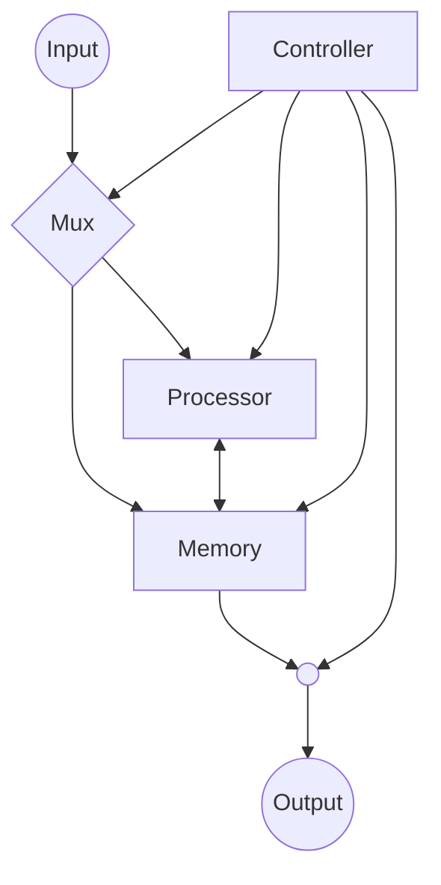

# Arqchitecture highlighs
The proposed architecture is aimed towards a modular approach. That is, a topology with focus on keeping processor pipeline integrity with minimum hazard introduction. To achieve this the solution is comprised of three main components:
- The processor:

  In the actual implementation, the processor is pipelined Point Adder in homogeneous projective coordinates.

- The memory:
  - Main memory: Is the proximity memory where the processor stores partial results
  - Segment memory: This is used as a renaming memory in order to maintain the processor pipeline integrity.
  
- The controller:

  This blocks is composed of several FSMs which define a policy of accessing the processor resource in order to maintain pipeline integrity.

## Modules 

* Karatsuba multiplication (kara_mul)
   - [x] Combinatorial
   - [x] Pipelined 
- Karatsuba optimization - LSB (kara_mul_low)
  - [x] Combinatorial
  - [ ] Pipelined 
- Karatsuba optimization - MSB (kara_mul_high)
  - [-] Combinatorial (Not fully tested)
  - [ ] Pipelined 
- Modular arithmetic - Addition (mod_add)
  - [x] Combinatorial
  - [x] Pipelined 
- Modular arithmetic - Multiplication by Barrett method (mod_mul)
  - [x] Combinatorial
  - [x] Pipelined 
- 377b point adder - Homogeneous projective coordinates (point_adder)
  - [x] Combinatorial
  - [x] Pipelined 
- Bucket method
  - [X] Structural
  - [X] Behavioral
    - [-] Loop1
    - [-] Loop2

## Possible optimizations

- Using the most of DSP multipliers in the Karatsuba tree. (We could reduce the resources but not necessarily the latency, since it depends on the height of the tree).
- Using canonical signed digit representation (CSD rep) for the constant multiplications. It could reduce the amount of logic needed for the intermediate multiplication of the Barrett.
- Maybe trying another coordinate system for the point adder (https://zprize.hardcaml.com/msm-mixed-point-addition-with-precomputation.html)
